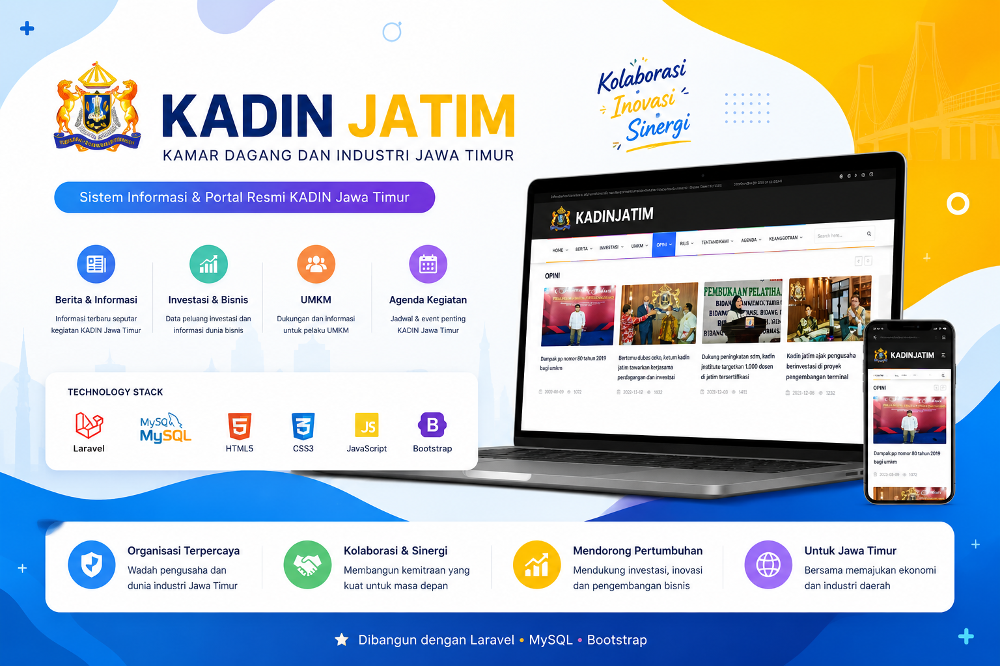
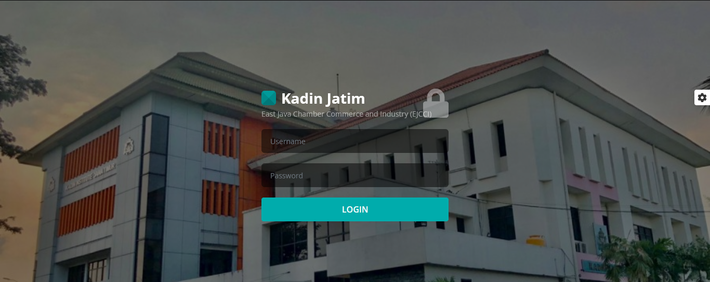
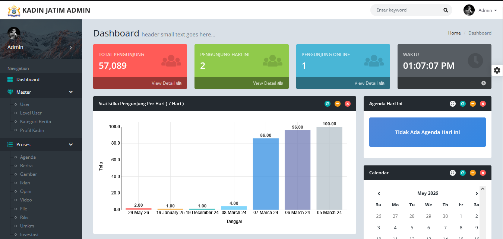
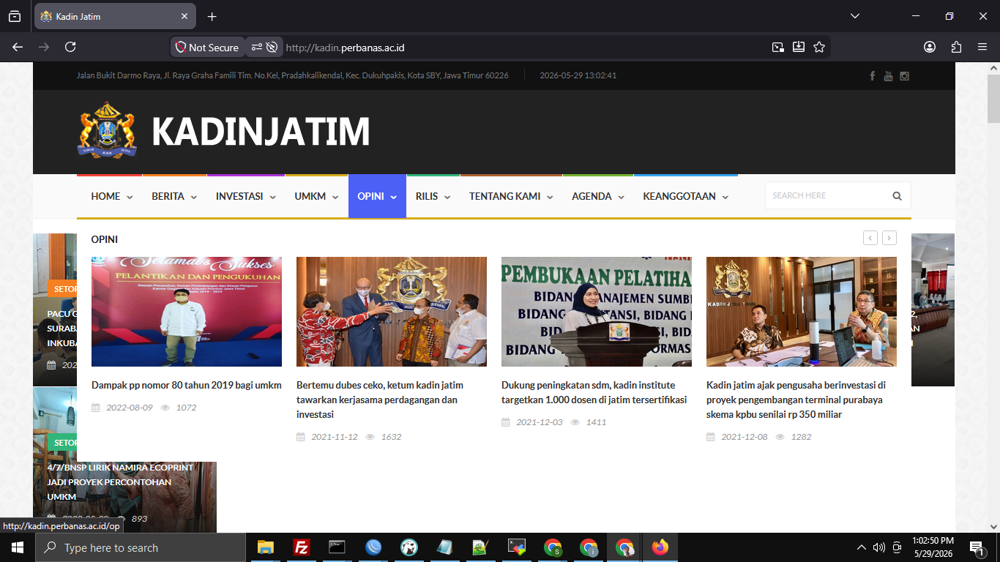

# KADIN JATIM
   

  

Aplikasi ini merupakan showcase / demo project yang digunakan untuk portofolio.
Beberapa data dan fitur mungkin tidak sepenuhnya lengkap atau disederhanakan untuk kebutuhan portofolio.

Sistem Informasi dan Portal Resmi KADIN Jawa Timur yang dikembangkan untuk mendukung publikasi informasi organisasi, berita, agenda kegiatan, investasi, UMKM, dan layanan digital organisasi secara terintegrasi.

---

## Tentang Project

KADIN JATIM Portal merupakan sistem informasi berbasis web yang dikembangkan untuk mendukung penyebaran informasi organisasi secara digital. Sistem menyediakan berbagai fitur pengelolaan konten dan publikasi informasi yang dapat diakses secara online melalui perangkat desktop maupun mobile.

Aplikasi dibangun menggunakan Laravel Framework dengan pendekatan responsive web design untuk memberikan pengalaman pengguna yang optimal.

---

## Fitur Utama

* Manajemen berita dan artikel
* Manajemen kategori konten
* Manajemen pengguna
* Publikasi agenda kegiatan
* Informasi investasi dan bisnis
* Portal UMKM
* Galeri foto, video dan dokumentasi
* Profil organisasi
* dll

---

## Teknologi yang Digunakan

* PHP
* Laravel Framework
* MySQL
* Bootstrap
* JavaScript

---

## Screenshot

### Login Page

  

### Dashboard

  

### BERITA

  

---

## Status

Project aktif digunakan sebagai portal informasi dan publikasi digital berbasis web.
